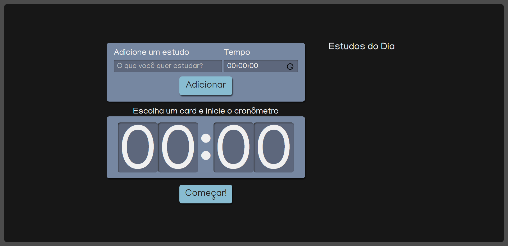

Projeto Alura Studies
```
Projeto desenvolvido durante o curso e idealizado para facilitar a organização
do usuario durante seu tempo de estudo.
```


## Tecnologias utilizadas no projeto
* React
* TypeScript
* SASS/ SCSS
* NodeJs